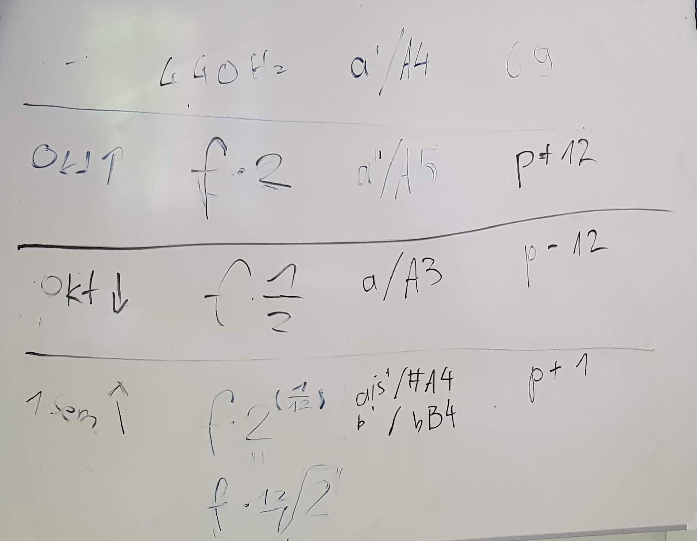

---
jupyter:
  jupytext:
    formats: ipynb,md
    text_representation:
      extension: .md
      format_name: markdown
      format_version: '1.3'
      jupytext_version: 1.13.8
  kernelspec:
    display_name: Python 3 (ipykernel)
    language: python
    name: python3
---

```python
import numpy as np
```

# Frequenzen - Pitches - MIDI



```python
def midi_to_freq(p):
    return 440 * 2 ** ((p - 69) / 12)
```

```python
print(midi_to_freq(69))
print(midi_to_freq(69 + 12))
print(midi_to_freq(69 - 12))
print(midi_to_freq(69 + 1))
print(midi_to_freq(60))
print(midi_to_freq(69 + 0.5)) # viertelton nach oben
```
