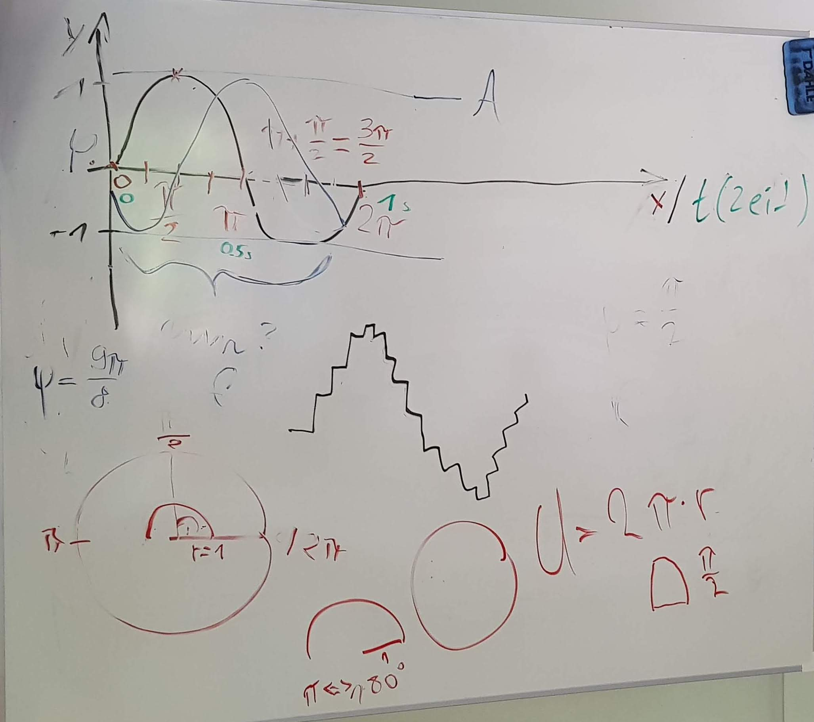

---
jupyter:
  jupytext:
    formats: ipynb,md
    text_representation:
      extension: .md
      format_name: markdown
      format_version: '1.3'
      jupytext_version: 1.13.8
  kernelspec:
    display_name: Python 3 (ipykernel)
    language: python
    name: python3
---

```python
import numpy as np
import matplotlib.pyplot as plt
from IPython.display import Audio
```

# Sinus generieren



```python
print(np.sin(0))
print(np.round(np.sin(1 / 4 * np.pi), 2))
print(np.round(np.sin(1 / 2 * np.pi), 2))
print(np.round(np.sin(3 / 4 * np.pi), 2))
print(np.round(np.sin(1 * np.pi), 2))
print(np.round(np.sin(5 / 4 * np.pi), 2))
print(np.round(np.sin(3 / 2 * np.pi), 2))
print(np.round(np.sin(7 / 4 * np.pi), 2))
print(np.round(np.sin(2 * np.pi), 2))
```

```python
num_values = 20

# x ist unser signal (typische benennung)
x = np.zeros(num_values)

for t in range(num_values):
    print(t, '\t',
          np.round(t / (num_values - 1), 3), '\t',
          np.round(t / (num_values - 1) * 2 * np.pi, 3), '\t',
          np.round(np.sin(t / (num_values - 1) * 2 * np.pi), 3))
    x[t] = np.sin(t / (num_values - 1) * 2 * np.pi)

plt.plot(x, '.')
```

```python
# loop vermeiden

num_values = 20 # (fast) aequivalent mit der sample-rate

# verschiedene varianten um `t` zu erzeugen
# t = np.arange(0, num_values) / (num_values - 1)
# t = np.arange(  0,  num_values / (num_values - 1),  1 / (num_values - 1)  ) # andere variante mit step-argument
t = np.linspace(0, 1, num_values)

print(t)

x = np.sin(t * 2 * np.pi)

plt.plot(x, '.')
plt.show()
```

---

## Amplitude, Frequenz, Phase

$x = A \cdot \sin((t \cdot 2 \pi - \phi) \cdot f)$

- $A$ -> Amplitude
- $\phi$ -> Phase
- $f$ -> Frequenz
- $t$ -> Zeit

```python
sr = 44100 # sample rate
length = 1 # in sec
freq = 3 # in Hz
amp = 0.5
phi = np.pi / 2

t = np.linspace(0, length, sr)
x = amp * np.sin((t * 2 * np.pi - phi) * freq)

plt.plot(t, x)
plt.ylim(-1, 1)
plt.show()
```

```python
# jetzt hoerbar

sr = 44100 # sample rate
length = 1 # in sec
freq = 110
t = np.linspace(0, length, sr)
x = np.sin(t * 2 * np.pi * freq)

plt.plot(t, x)
plt.show()

display(Audio(x, rate=sr))
```
